# 🎉 Eventify — Etkinlik Planlama Uygulaması

Kullanıcıların etkinlik oluşturabildiği, katılım sağlayabildiği ve yönettiği full-stack bir web uygulaması.

---

## 🛠 Kullanılan Teknolojiler

### Backend
- Java 21
- Spring Boot 4.0.4
- Spring Data JPA / Hibernate
- H2 Database (dosya tabanlı)
- Spring Cache
- Spring Scheduling (otomatik arşivleme)
- Swagger (SpringDoc OpenAPI)
- BCrypt (şifre hashleme)
- ModelMapper
- Lombok
- JUnit 5 / Mockito (testler)

### Frontend
- Angular 21
- Bootstrap 5
- Bootstrap Icons
- TypeScript

---

## 📁 Proje Yapısı
- **backend/** → Spring Boot Backend
- **frontend/** → Angular Frontend
---

## ⚙️ Kurulum & Çalıştırma

### Gereksinimler
- Java 21+
- Node.js 18+
- Angular CLI (`npm install -g @angular/cli`)

---

### Backend Çalıştırma

```bash
cd demo1
./mvnw spring-boot:run
```

Backend `http://localhost:8050` adresinde çalışır.

> H2 veritabanı otomatik oluşturulur. Görsel yüklemeler için `uploads/event-images/` klasörü uygulama tarafından otomatik oluşturulur.

---

### Frontend Çalıştırma

```bash
cd event-app
npm install
ng serve
```

Frontend `http://localhost:4200` adresinde çalışır.

---

## 🗄 Veritabanı Bilgileri

| Özellik | Değer |
|---|---|
| Tip | H2 (dosya tabanlı) |
| URL | `jdbc:h2:file:~/eventdb` |
| Kullanıcı adı | `sa` |
| Şifre | `sa` |
| H2 Console | `http://localhost:8050/h2-console` |

---

## 📖 Swagger API Dokümantasyonu

Uygulama çalışırken tüm API endpoint'leri Swagger üzerinden test edilebilir:
http://localhost:8050/swagger-ui/index.html

---

## ✨ Özellikler

### Kullanıcı İşlemleri
- Kayıt ol (ad, soyad, email, telefon, şifre)
- Giriş yap (email veya telefon ile)
- Oturum yönetimi (HTTP Session)
- Çıkış yap

### Etkinlik İşlemleri
- Etkinlik oluştur (başlık, açıklama, tarih, konum, kategori, görsel)
- Etkinlik listele (arama, kategori filtresi, sıralama, pagination)
- Etkinlik detayı görüntüle
- Etkinlik düzenle ve sil
- Görsel yükleme (JPG/PNG, max 2MB)

### Etkinlik Durumları
- **Yayında (PUBLISHED):** Herkese açık, katılıma açık
- **Yayın Durduruldu (UNPUBLISHED):** Gizli, katılıma kapalı, tekrar yayınlanabilir
- **Arşivlendi (ARCHIVED):** Kalıcı olarak kapalı, süresi geçmiş etkinlikler otomatik arşivlenir

### Katılım & Sosyal
- Etkinliğe katıl / ayrıl
- Etkinliği beğen / beğeniyi geri çek
- Yorum yap, düzenle, sil
- Katılımcı listesi görüntüleme (etkinlik sahibine özel)
- Katılımcı etkinlikten çıkarma

### Kişisel Sayfalar
- Etkinliklerim (oluşturduğum etkinlikler, durum yönetimi)
- Beğendiklerim
- Katıldıklarım (status filtreleme ile)

---

## 🧪 Testler

```bash
cd demo1
./mvnw test
```

Proje kapsamında şu test türleri mevcuttur:
- **Repository Tests** — JPA query doğrulamaları (`@DataJpaTest`)
- **Service Tests** — İş mantığı unit testleri (Mockito)
- **Controller Tests** — REST endpoint testleri (`@WebMvcTest`)

---

## 🔐 Güvenlik

- HTTP Session tabanlı kimlik doğrulama
- Session fixation koruması
- BCrypt ile şifre hashleme
- Session filter ile korumalı endpoint'ler
- Görsel yüklemede MIME tipi, uzantı ve boyut kontrolü
- Double extension koruması
- CORS yapılandırması (`http://localhost:4200`)

---

## 📸 Ekran Görüntüleri

### 🔐 Giriş Yap
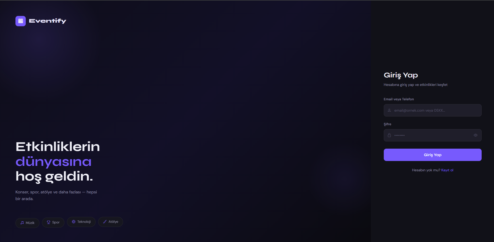

### 📝 Kayıt Ol
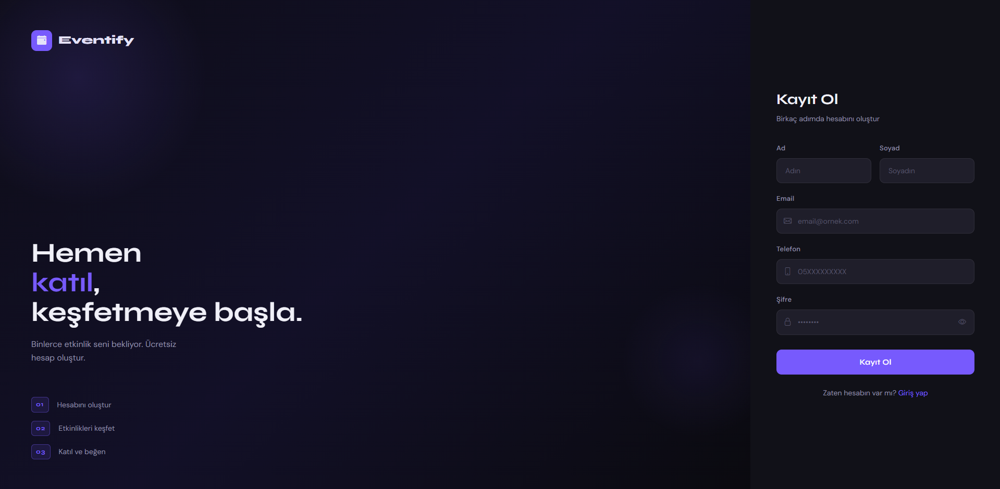

### 🎉 Etkinlik Listesi
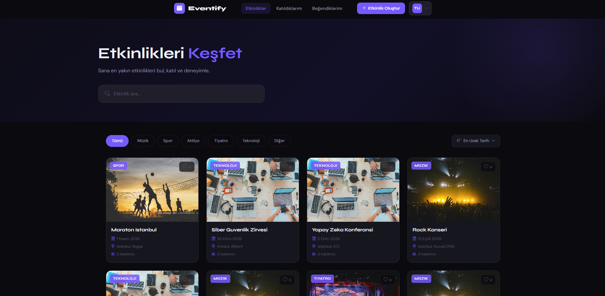

### 📋 Etkinlik Detayı
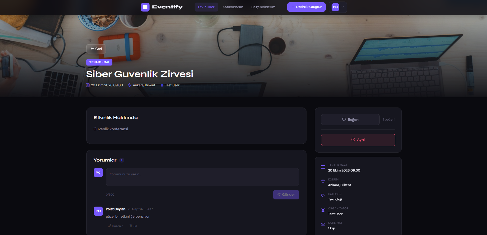

### ➕ Etkinlik Oluştur
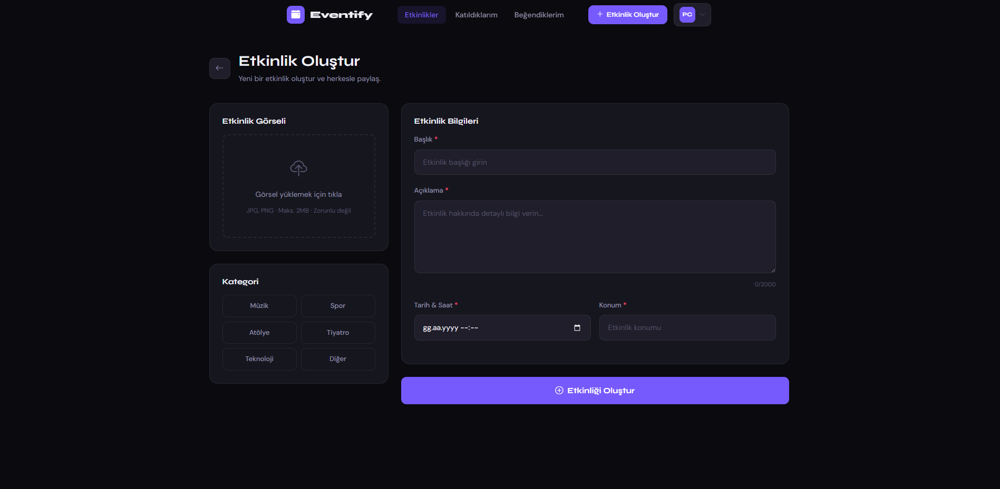

### ✏️ Etkinlik Düzenle
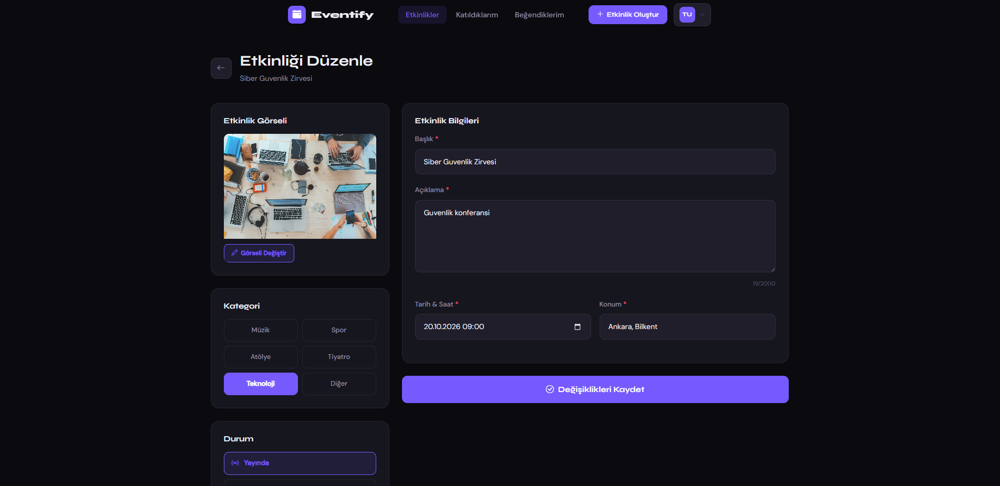

### 📅 Etkinliklerim
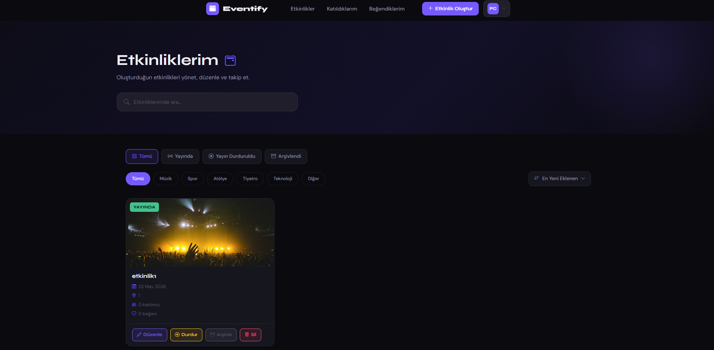

### ❤️ Beğendiklerim
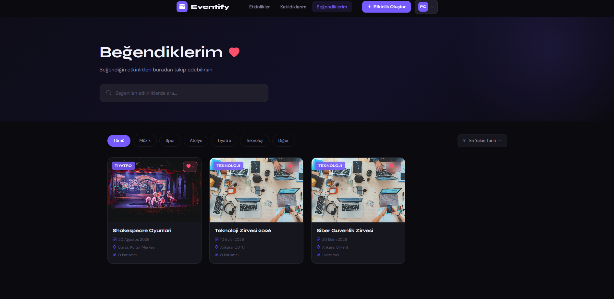

### 👥 Katıldıklarım
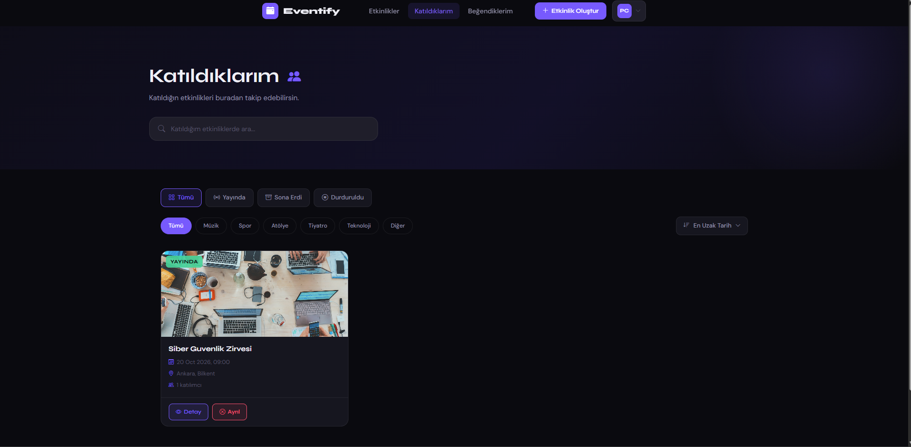

### 🚫 Katılımcı Yönetimi
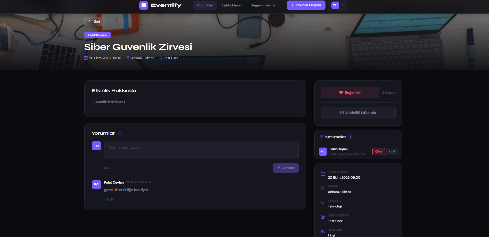

### 📖 Swagger API Dokümantasyonu
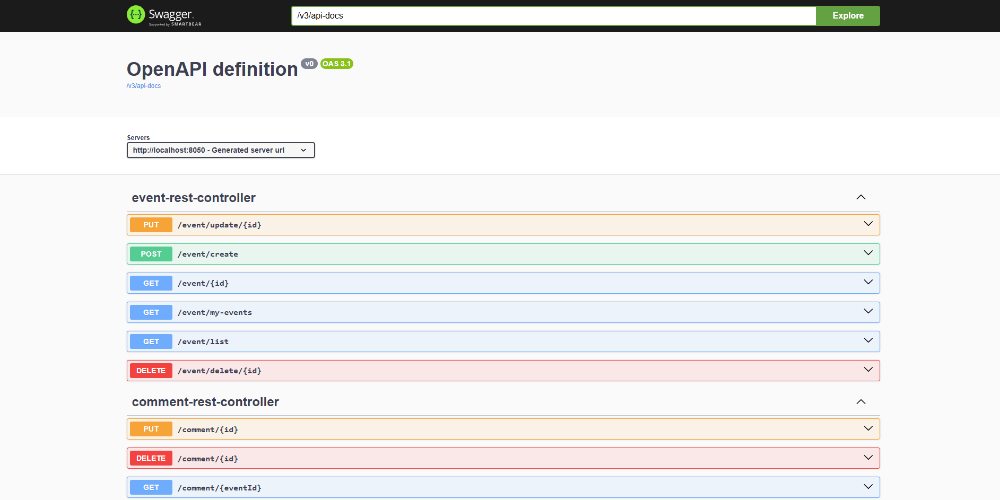
